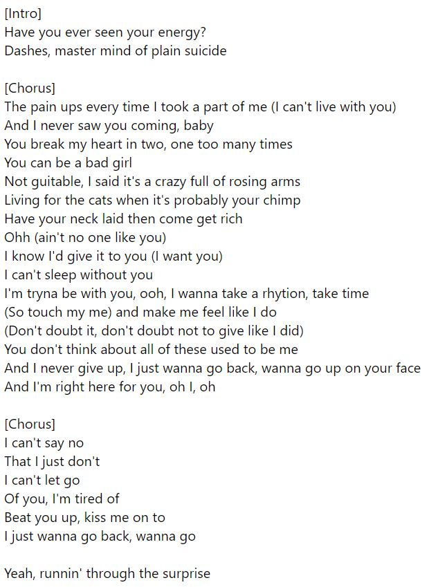

<h1 align="center">
   
  CHANSONG
   
</h1>

  <a href="#background">Background</a> •
  <a href="#web-app-usage">Web App Usage</a> •
  <a href="#acknowledgements">Acknowledgements</a> •
  <a href="#authors">Authors</a> •
  <a href="#license">License</a>

## Background
Recurrent Neural Networks are a common tool used in NLP tasks nowadays. We trained 20+ models using Tensorflow to generate lyrics. Models were trained on either 4 or 19 artists, with different configurations in architectures (various combinations of LSTMs and GRUs), sequence length, and RNN units to explore the effect of these choices on dataset. Original lyric data is in the folder `scraping`, named `DS_1.txt` and `DS_2.txt` for the small and big datasets respectively. Note that the big dataset is only 20MB and so is still relatively low. In the future, a larger dataset (at least 100MB) may be scraped and tested. A more in depth write-up about the details and results of the project will be written in the near future. 

## Web App Usage
There is a small (functional) React app with a Flask backend, which will be moved to an actual site in the near future. To run the frontend, found in the folder `rnn-genius-app`, instlall the necessary packages using `npm install` and run `npm start`. To run the backend, found in the folder `backend`, set the `FLASK_APP` variable to `main.py` (on Unix, it is `export FLASK_APP=main.py`) and run it with `flask run`. On the web app, there are a few different settings to play around with to generate lyrics.

## Examples

## Acknowledgements
CHANSONG was built with:
* [TensorFlow 2.0](https://www.tensorflow.org/guide/keras/rnn)
* [Flask](https://flask.palletsprojects.com/en/1.1.x/)
* [React](https://reactjs.org/)

CHANSONG is inspired by Andrej Karpathy's [blog post](http://karpathy.github.io/2015/05/21/rnn-effectiveness/) on the effectiveness of recurrent neural networks.

Models were trained on a lyrics dataset scraped using the [Genius API](https://docs.genius.com/), and the (mostly) cleaned files are found [here](https://github.com/jimwu6/rnn-genius/tree/master/scraping). Some files may have non-lyric portions because Genius has text from media other than songs (e.g. interviews, concert lists). All the files have at most 84 unique characters to keep consistent while training on different datasets. 

## Authors
Made by [Jim](https://github.com/jimwu6) and [Ryan](https://github.com/ryli123). We don't know what's going on.

## License
This project is under an [MIT license](https://github.com/jimwu6/rnn-genius/blob/master/LICENSE.md).

